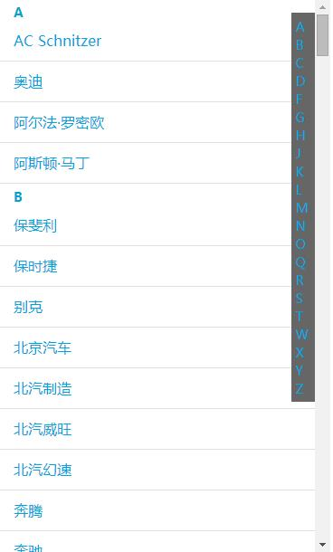

# scrollTo
纯js实现平滑滚动



## 特性

* 支持滚动到确定位置
* 支持zepto/jquery对象的传入
* 压缩后大小不到1kb
* 无需zepto/jquery也可以正常使用

## 使用场景
* 返回顶部
* 点击侧栏的ABCDE...字母滚动到指定区域,用于城市列表选择等

## 引用
引入`scrollTo.min.js`:
```
<script type="text/javascript" src="scrollTo.min.js"></script> 
```

## 示例
```javascript
$('.charlist').delegate('.react','click',function(){
    var href = $(this).attr('href').substr(1);
		$.scrollTo($('#sub-' + href));
		//$scrollTo($('#sub-' + href)); //纯js这样使用
    return false;
});
```
具体代码看demo:`demo.html`
[demo](demo.html)

